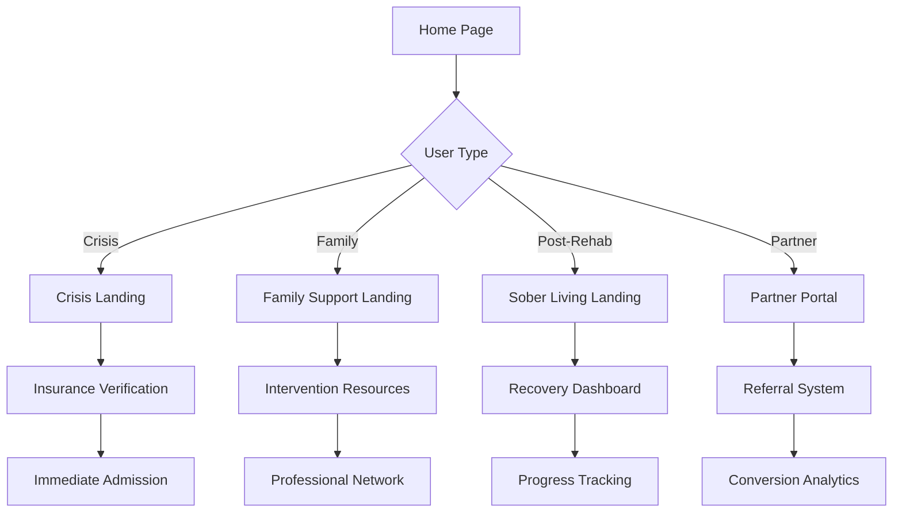

## 1. Product Overview
MetzlerCares is a conversion-focused landing page system targeting the Colorado rehab/sober living market. The platform helps different user personas find appropriate addiction treatment and sober living options while providing an engaging, gamified experience that encourages referrals and ongoing engagement.

The system solves the critical problem of connecting people in crisis with appropriate treatment options while making the process less intimidating and more engaging through gamification and modern UI design.

## 2. Core Features

### 2.1 User Roles
| Role | Registration Method | Core Permissions |
|------|---------------------|------------------|
| Crisis Seeker | Anonymous/Phone verification | Browse treatment options, verify insurance, request immediate help |
| Family Member | Email registration | Research options, intervention resources, family support tools |
| Post-Rehab User | Email/Social registration | Sober living search, recovery tracking, buddy matching |
| Partner Organization | Company code invitation | Referral tracking, partnership dashboard, shared resources |

### 2.2 Feature Module
The MetzlerCares system consists of the following main pages:
1. **Crisis Landing Page**: Immediate help options, insurance verification, urgency indicators
2. **Family Support Landing Page**: Intervention guidance, family resources, treatment research tools
3. **Sober Living Landing Page**: Post-rehab housing search, recovery community, buddy matching
4. **Insurance Verification Page**: Real-time qualification checking, coverage details, cost estimation
5. **Gamified Dashboard**: Progress tracking, achievements, social sharing, referral system
6. **Partner Portal**: Company code access, referral tracking, partnership management

### 2.3 Page Details
| Page Name | Module Name | Feature description |
|-----------|-------------|---------------------|
| Crisis Landing | Hero Section | Display urgent help CTA with "3 beds available" scarcity indicators and immediate admission options |
| Crisis Landing | Insurance Widget | Real-time insurance verification with Medicaid/Medicare support and instant qualification feedback |
| Crisis Landing | Trust Signals | Show accreditations, success rates, testimonials, and emergency contact information |
| Family Support Landing | Intervention Guide | Step-by-step intervention planning with downloadable resources and professional referral network |
| Family Support Landing | Treatment Research | Compare facilities, read reviews, and access family therapy resources |
| Sober Living Landing | Housing Search | Filter by location, amenities, rules, and peer compatibility with virtual tours |
| Sober Living Landing | Recovery Community | Connect with recovery buddies, join support groups, and access relapse prevention tools |
| Insurance Verification | Coverage Checker | Multi-step form with real-time API integration to major insurance providers |
| Insurance Verification | Cost Calculator | Estimate out-of-pocket costs based on coverage and treatment type |
| Gamified Dashboard | Progress Tracking | Visual recovery milestones, achievement badges, and personal statistics |
| Gamified Dashboard | Social Features | Recovery buddy matching, achievement sharing, and community challenges |
| Partner Portal | Referral System | Track referred clients, view partnership metrics, and access shared resources |
| Partner Portal | Company Dashboard | Manage multiple referrals, view conversion analytics, and access training materials |

## 3. Core Process

### Crisis Seeker Flow
User arrives via search → Sees immediate help options → Completes insurance verification → Gets matched with available beds → Receives admission instructions

### Family Member Flow
User arrives via search → Accesses intervention resources → Researches treatment options → Connects with professional help → Tracks loved one's progress

### Post-Rehab User Flow
User searches for sober living → Creates recovery profile → Finds compatible housing → Joins recovery community → Tracks progress and achievements

### Partner Organization Flow
Partner receives company code → Accesses referral portal → Submits client referrals → Tracks conversion metrics → Accesses shared resources

## 4. User Interface Design

### 4.1 Design Style
- **Primary Colors**: Deep blue (#1e40af) for trust, warm orange (#f97316) for urgency/CTAs
- **Secondary Colors**: Soft gray (#f3f4f6) backgrounds, green (#10b981) for success states
- **Button Style**: Rounded corners with subtle shadows, prominent CTAs with hover effects
- **Font**: Modern sans-serif (Inter), 16px base size with clear hierarchy
- **Layout**: Card-based design with generous whitespace, mobile-first approach
- **Icons**: Clean, accessible SVG icons with consistent stroke width

### 4.2 Page Design Overview
| Page Name | Module Name | UI Elements |
|-----------|-------------|-------------|
| Crisis Landing | Hero Section | Large urgent CTA button, countdown timer for bed availability, emergency phone number prominently displayed |
| Crisis Landing | Insurance Widget | Multi-step form with progress indicator, real-time validation, instant feedback badges |
| Family Support Landing | Intervention Guide | Accordion-style expandable sections, downloadable PDF resources, video testimonials |
| Sober Living Landing | Housing Search | Filter sidebar with map integration, card-based results with virtual tour buttons |
| Gamified Dashboard | Progress Tracking | Circular progress indicators, achievement badge grid, milestone celebration animations |
| Partner Portal | Referral Dashboard | Data tables with conversion metrics, chart visualizations, export functionality |

### 4.3 Responsiveness
- Mobile-first design with breakpoints at 640px, 768px, 1024px
- Touch-optimized interactions with appropriate tap targets
- Progressive enhancement for larger screens
- Accessibility compliance with WCAG 2.2 AA standards
- Core Web Vitals optimization for fast loading