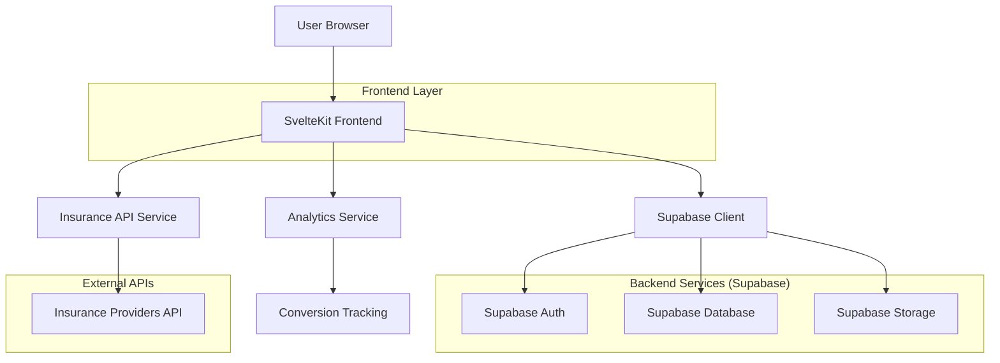
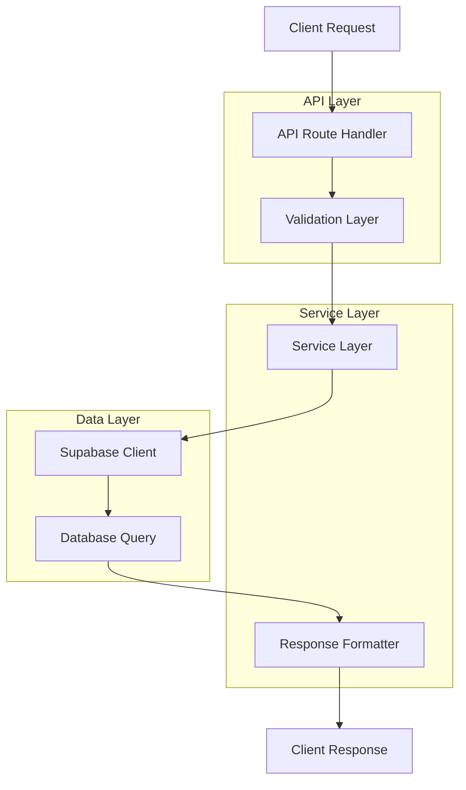
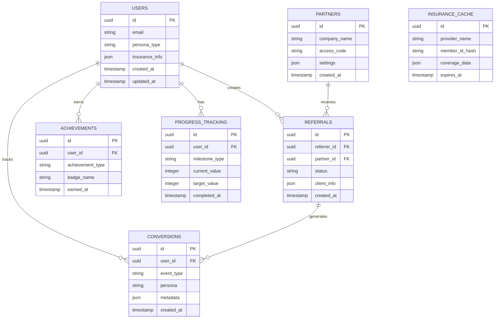

## 1. Architecture Design



## 2. Technology Description
- Frontend: SvelteKit + TypeScript + Tailwind CSS
- Backend: Supabase (PostgreSQL, Auth, Storage)
- Styling: Tailwind CSS with custom components
- Forms: Svelte Forms Lib with Yup validation
- Charts: Chart.js for analytics visualization
- Maps: Mapbox GL JS for location services

## 3. Route Definitions

| Route | Purpose |
|-------|---------|
| / | Home page with persona selection |
| /crisis | Crisis landing page with immediate help |
| /family | Family support landing page |
| /sober-living | Sober living search and community |
| /insurance | Insurance verification wizard |
| /dashboard | Gamified user dashboard |
| /partner/[code] | Partner portal with referral tracking |
| /api/insurance/verify | Insurance verification endpoint |
| /api/analytics/track | Conversion tracking endpoint |
| /api/referrals | Referral management endpoint |

## 4. API Definitions

### 4.1 Insurance Verification API
```
POST /api/insurance/verify
```

Request:
| Param Name | Param Type | isRequired | Description |
|------------|------------|------------|-------------|
| provider | string | true | Insurance provider name |
| member_id | string | true | Member ID number |
| group_number | string | false | Group number if applicable |
| dob | string | true | Date of birth (YYYY-MM-DD) |

Response:
| Param Name | Param Type | Description |
|------------|------------|-------------|
| verified | boolean | Insurance verification status |
| coverage_type | string | Type of coverage available |
| deductible | number | Annual deductible amount |
| copay | number | Copay amount per visit |
| network_status | string | In-network or out-of-network |

### 4.2 Conversion Tracking API
```
POST /api/analytics/track
```

Request:
| Param Name | Param Type | isRequired | Description |
|------------|------------|------------|-------------|
| event_type | string | true | Type of conversion event |
| user_id | string | false | User ID if authenticated |
| persona | string | true | User persona type |
| page_url | string | true | Current page URL |
| metadata | object | false | Additional event data |

## 5. Server Architecture Diagram



## 6. Data Model

### 6.1 Database Schema


### 6.2 Data Definition Language

```sql
-- Users table
CREATE TABLE users (
    id UUID PRIMARY KEY DEFAULT gen_random_uuid(),
    email VARCHAR(255) UNIQUE,
    persona_type VARCHAR(50) NOT NULL CHECK (persona_type IN ('crisis', 'family', 'post-rehab', 'partner')),
    insurance_info JSONB,
    recovery_start_date DATE,
    created_at TIMESTAMP WITH TIME ZONE DEFAULT NOW(),
    updated_at TIMESTAMP WITH TIME ZONE DEFAULT NOW()
);

-- Conversions tracking
CREATE TABLE conversions (
    id UUID PRIMARY KEY DEFAULT gen_random_uuid(),
    user_id UUID REFERENCES users(id),
    event_type VARCHAR(100) NOT NULL,
    persona VARCHAR(50) NOT NULL,
    page_url VARCHAR(500),
    metadata JSONB,
    created_at TIMESTAMP WITH TIME ZONE DEFAULT NOW()
);

-- Referrals system
CREATE TABLE referrals (
    id UUID PRIMARY KEY DEFAULT gen_random_uuid(),
    referrer_id UUID REFERENCES users(id),
    partner_id UUID REFERENCES partners(id),
    client_name VARCHAR(255),
    client_phone VARCHAR(20),
    status VARCHAR(50) DEFAULT 'pending' CHECK (status IN ('pending', 'contacted', 'admitted', 'completed')),
    referral_date DATE DEFAULT CURRENT_DATE,
    notes TEXT,
    created_at TIMESTAMP WITH TIME ZONE DEFAULT NOW()
);

-- Partners/Organizations
CREATE TABLE partners (
    id UUID PRIMARY KEY DEFAULT gen_random_uuid(),
    company_name VARCHAR(255) NOT NULL,
    access_code VARCHAR(100) UNIQUE NOT NULL,
    contact_email VARCHAR(255),
    settings JSONB DEFAULT '{}',
    is_active BOOLEAN DEFAULT true,
    created_at TIMESTAMP WITH TIME ZONE DEFAULT NOW()
);

-- Achievements/Badges
CREATE TABLE achievements (
    id UUID PRIMARY KEY DEFAULT gen_random_uuid(),
    user_id UUID REFERENCES users(id),
    achievement_type VARCHAR(100) NOT NULL,
    badge_name VARCHAR(255) NOT NULL,
    badge_icon VARCHAR(100),
    points_earned INTEGER DEFAULT 0,
    earned_at TIMESTAMP WITH TIME ZONE DEFAULT NOW()
);

-- Progress tracking
CREATE TABLE progress_tracking (
    id UUID PRIMARY KEY DEFAULT gen_random_uuid(),
    user_id UUID REFERENCES users(id),
    milestone_type VARCHAR(100) NOT NULL,
    current_value INTEGER DEFAULT 0,
    target_value INTEGER NOT NULL,
    milestone_name VARCHAR(255),
    completed_at TIMESTAMP WITH TIME ZONE,
    created_at TIMESTAMP WITH TIME ZONE DEFAULT NOW()
);

-- Insurance verification cache
CREATE TABLE insurance_cache (
    id UUID PRIMARY KEY DEFAULT gen_random_uuid(),
    provider_name VARCHAR(255) NOT NULL,
    member_id_hash VARCHAR(255) NOT NULL,
    coverage_data JSONB NOT NULL,
    expires_at TIMESTAMP WITH TIME ZONE NOT NULL,
    created_at TIMESTAMP WITH TIME ZONE DEFAULT NOW()
);

-- Bed availability tracking
CREATE TABLE bed_availability (
    id UUID PRIMARY KEY DEFAULT gen_random_uuid(),
    facility_name VARCHAR(255) NOT NULL,
    available_beds INTEGER NOT NULL,
    total_beds INTEGER NOT NULL,
    last_updated TIMESTAMP WITH TIME ZONE DEFAULT NOW()
);

-- Create indexes for performance
CREATE INDEX idx_users_persona ON users(persona_type);
CREATE INDEX idx_conversions_user_id ON conversions(user_id);
CREATE INDEX idx_conversions_created_at ON conversions(created_at DESC);
CREATE INDEX idx_referrals_partner_id ON referrals(partner_id);
CREATE INDEX idx_referrals_status ON referrals(status);
CREATE INDEX idx_achievements_user_id ON achievements(user_id);
CREATE INDEX idx_progress_user_id ON progress_tracking(user_id);
CREATE INDEX idx_insurance_cache_provider ON insurance_cache(provider_name, member_id_hash);

-- Grant permissions
GRANT SELECT ON ALL TABLES TO anon;
GRANT ALL PRIVILEGES ON ALL TABLES TO authenticated;

-- Row Level Security (RLS) policies
ALTER TABLE users ENABLE ROW LEVEL SECURITY;
ALTER TABLE conversions ENABLE ROW LEVEL SECURITY;
ALTER TABLE referrals ENABLE ROW LEVEL SECURITY;
ALTER TABLE achievements ENABLE ROW LEVEL SECURITY;
ALTER TABLE progress_tracking ENABLE ROW LEVEL SECURITY;

-- Users can only see their own data
CREATE POLICY users_own_data ON users FOR ALL USING (auth.uid() = id);
CREATE POLICY conversions_own_data ON conversions FOR ALL USING (user_id = auth.uid());
CREATE POLICY achievements_own_data ON achievements FOR ALL USING (user_id = auth.uid());
CREATE POLICY progress_own_data ON progress_tracking FOR ALL USING (user_id = auth.uid());

-- Partners can see their own referrals
CREATE POLICY referrals_partner_access ON referrals FOR ALL USING (partner_id IN (
    SELECT id FROM partners WHERE access_code = current_setting('app.partner_code', true)
));
```